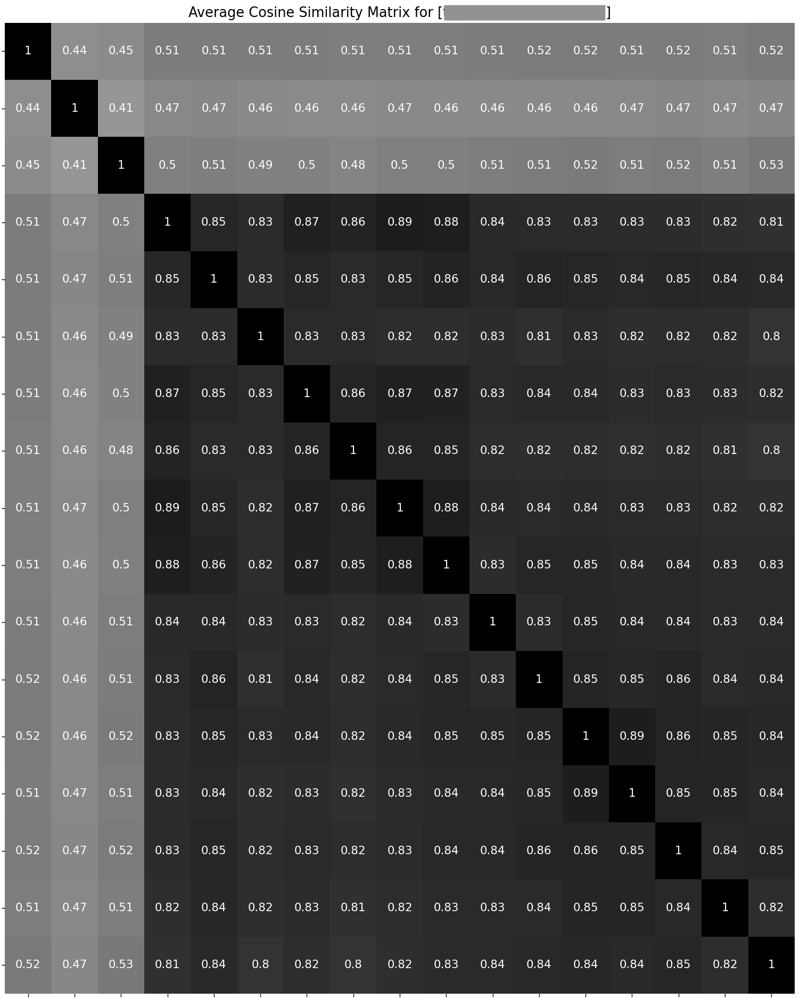

# Text Similarity Calculator

Quick and naive comparison of text similarity (perhaps on different levels of granularity).

*Last Updated: Apr 25, 2023*

## Quick Start

### Env Setup

Run the following line to create virtual environment using `conda`:

```bash
source setup.sh
```

### Solutions

#### Data Prep

Current codes only accept the following format of input files:

- file format: `json`
- content format:

    ```text
    [{
        'case_id': str,
        'sentence1': str,
        'sentence2': str, 
        ...
    }, ...]
    ```

    ...where `case_id` is an optional field as the case identifier, and all other values will be considered text strings to compute embeddings and similarity scores of.

#### Similarity Computation

Specify the choice of models in configuration following the structure in [this example](cfg/sample-transformers.yaml), and then run:

```bash
python3 -m src.compute \
        -c <config_filepath_here>
```

#### Plotting

With the generated pickle file from last step, it's possible to plot the similarity matrix by running:

```bash
python3 -m src.plot \
        -s <pickle_filepath_here>
```

Sample plots are here for sample display:

- average cosine similarity matrix

    

- singular cosine similarity matrices

    

## Repo Structure

The repository is organized as follows:

```bash
.
├── LICENSE
├── README.md
├── cfg
│   └── sample-transformers.yaml
├── requirements.txt
├── setup.sh
└── src
    ├── __init__.py
    ├── compute.py
    ├── models.py
    ├── plot.py
    └── utils.py

2 directories, 10 files
```
